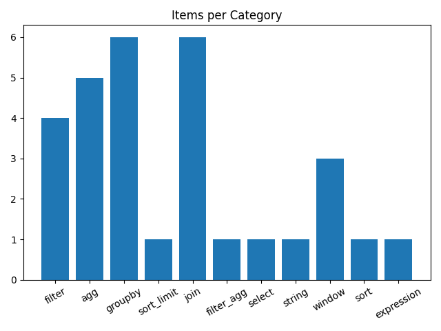
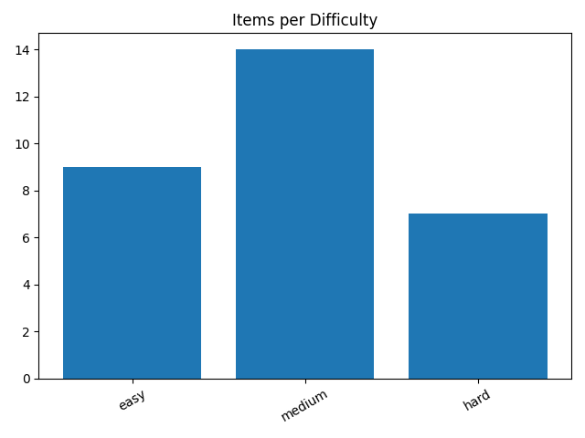
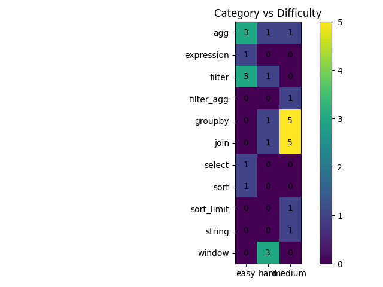

# text2Polars

Natural-language to Polars code generation. A small LLM generates executable Polars DataFrame code from plain English questions, served via FastAPI.

## Setup

```bash
pip install transformers accelerate polars torch fastapi uvicorn requests

# Serve the model
uvicorn main:app --host 0.0.0.0 --port 8000
```

Hardware: NVIDIA GeForce RTX 5090 (RunPod VM).

## Synthetic Benchmark

30 question-code pairs generated with ChatGPT, covering 11 Polars operation categories across 3 difficulty levels.





```bash
python make_benchmark.py   # generates bench.json
```

**Next**: convert existing Text2SQL datasets to Text2Polars — SQL-to-Polars translation is more reliable than generating instruction-code pairs from scratch.

## Prompt Engineering

Three prompt variants tested:

| Variant | System Prompt | Few-Shot Examples |
|---|---|---|
| `baseline` | 9-rule detailed prompt | 10 examples |
| `terse` | Minimal 4-rule prompt | 10 examples |
| `no_fewshot` | 9-rule detailed prompt | 0 (ablation) |

10 few-shot examples cover: filter+scalar, group-by, computed columns, inner join, anti-join, string `.str`, date `.dt`, `pl.when/then`, window `.over()`, and multi-aggregation.

## Pseudo-RAG (API Snippet Routing)

Instead of retrieving from a vector store, `prompt_routing.py` classifies each question using regex patterns on the question text and schema column dtypes, then injects targeted Polars API snippets into the prompt.

Categories: `string`, `join`, `window`, `date`, `when_then`, `null_nan`, `concat`, `groupby_multi`.

Schema-aware signals:
- Multi-table schema automatically triggers the join snippet
- Date/Datetime columns trigger the date snippet even without date keywords
- String columns + name-like filters trigger the string snippet

## Experiments & Results

`run.py` is an eval framework that mirrors the platform's evaluation backend:
- Calls the model to generate Polars code
- Executes generated code in a sandboxed Python subprocess
- Compares output against gold answers (tolerant: row order, float precision, dtype casting)
- Tracks VRAM, wall time, and computes accuracy
- Scores using: `Score = N / (T * VRAM^0.1 * RAM^0.01)`

```bash
# Run the full grid (5 models x 3 prompts x 2 routing = 30 experiments)
python run.py --bench bench.json

# Run a custom grid
python run.py --bench bench.json --grid samples/grid.json

# Quick test
python run.py --bench bench.json --limit 5 --dry-run
```

Models evaluated:

| Model | Parameters |
|---|---|
| `Qwen/Qwen2.5-Coder-1.5B-Instruct` | 1.5B |
| `Qwen/Qwen3-4B-Instruct-2507` | 4B |
| `google/gemma-4-E2B-it` | 2B |
| `google/gemma-4-E4B-it` | 4B |
| `Qwen/Qwen2.5-Coder-7B-Instruct` | 7B |

Best result: **Qwen/Qwen3-4B-Instruct-2507** with baseline prompt + routing enabled — 77% accuracy, score 0.34.

## Next Steps

- **Bigger benchmark**: convert Text2SQL datasets (Spider, WikiSQL) to Text2Polars for a larger and more diverse eval set
- **Prompt iteration**: analyze `failures.csv` to find systematic error patterns and add targeted few-shot examples
- **Model finetuning**: finetune on a synthetic dataset thant can be converted from text2SQL datasets